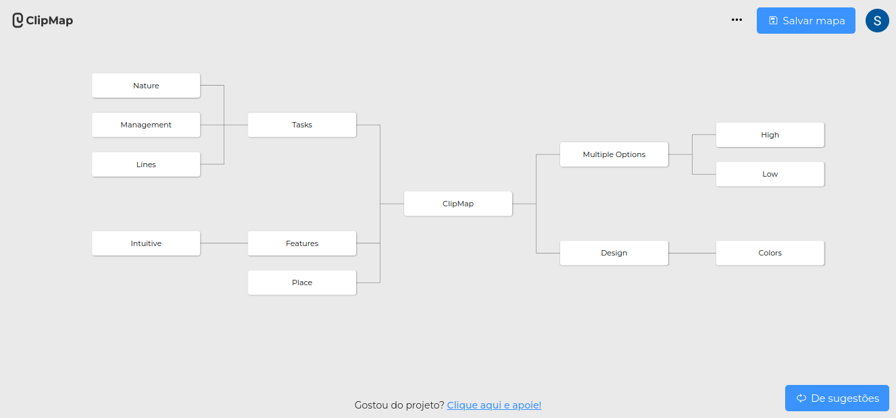
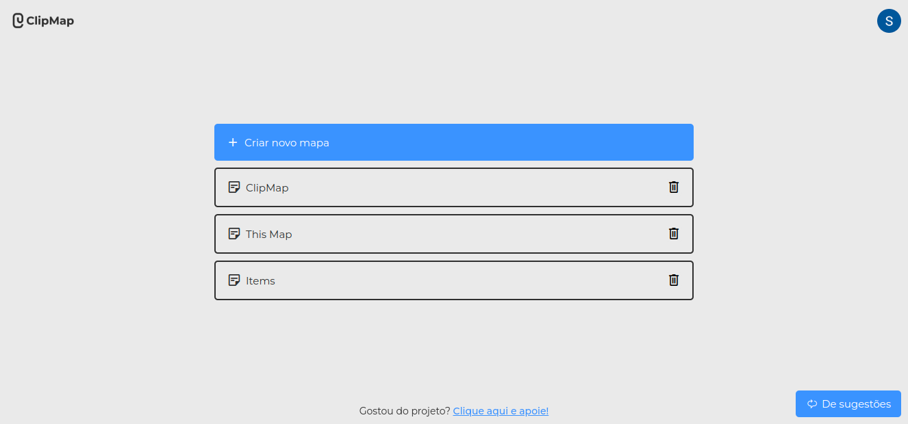
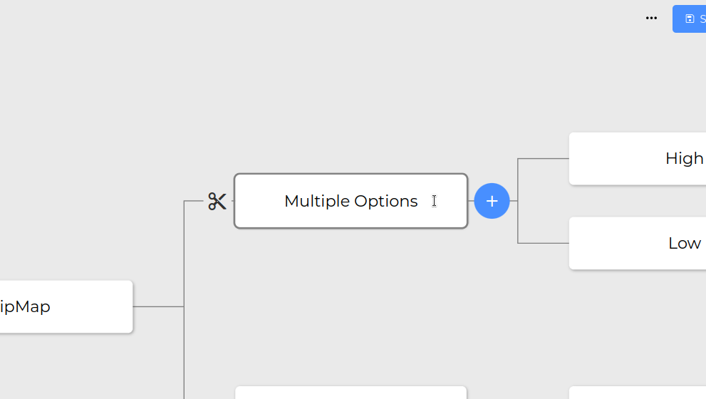

# ClipMap - A tool to create mind maps

Check out the official website here: https://clipmap.net/

ClipMap is a web application designed for creating mind maps.

ClipMap uses Google OAuth2, allowing you to log in with any Google account.

You can create unlimited maps with ClipMap for free.

You can start creating your map without having to log in on the main page of the app, providing easy access.

The simple interface is user-friendly, without an overwhelming number of buttons and options.

Code by [Leo Teles](https://github.com/telesleo).
 
Design by [Lucas Teles](https://github.com/lucastelesss).
